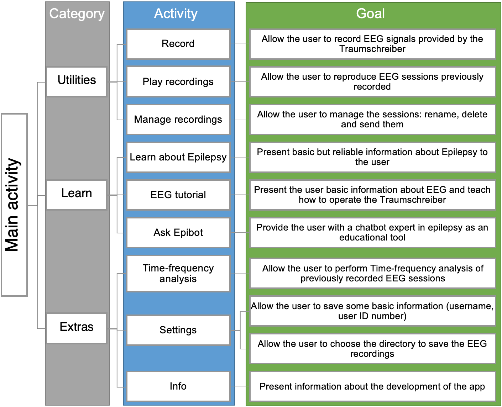
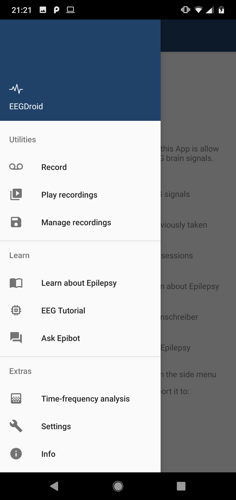
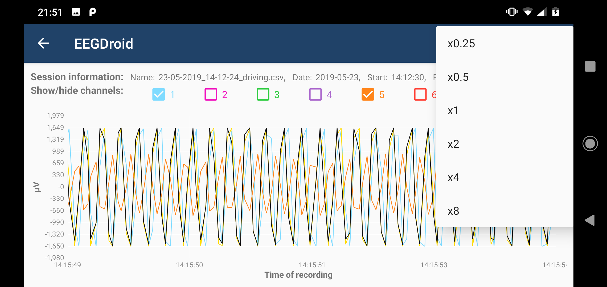
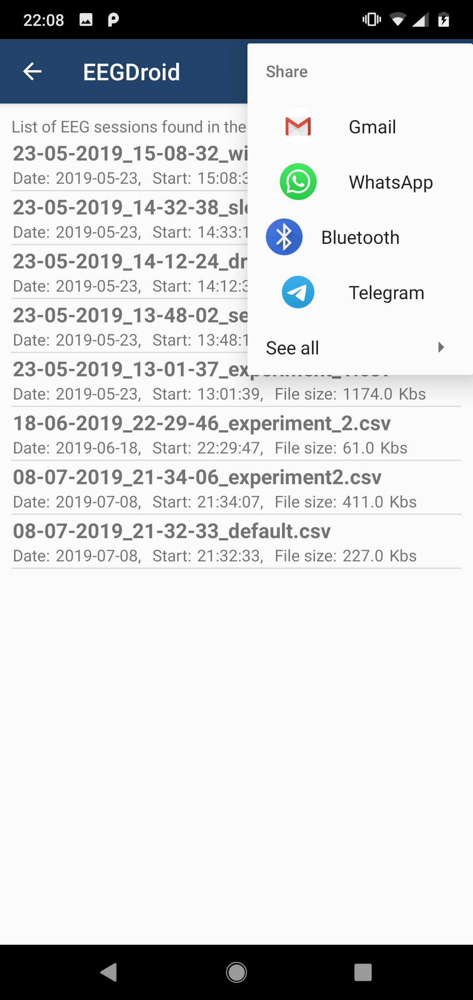
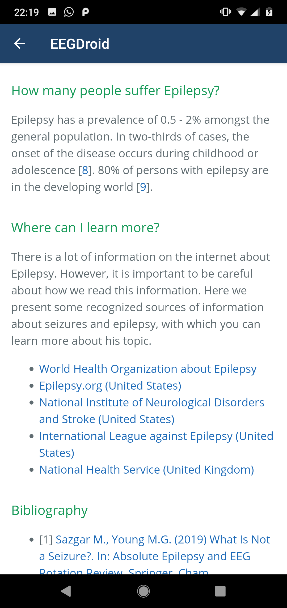

## Android app for EEG data recording with the Traumschreiber

We design an Android app to collect, plot, record, save, manage, and share EEG sessions, using the [Traumschreiber EEG device](https://www.traumschreiber.uni-osnabrueck.de/). The app also presents reliable information about epilepsy and counts with a chatbot expert in epilepsy, with whom the user can chat to evacuate doubts about these topics.

An architecture was design with a total of 10 different modules. In this architecture, the main functionality of the app was split between the different modules. As a result of the implementation phase, we produced a reliable and stable app, which allows the user to collect, plot, record, save, manage and share EEG sessions, as well as learn about epilepsy and EEG.

## Important links
We integrate different apps in one single project:
- https://github.com/StatefulMind/eegdroid/
- https://github.com/mvidaldp/Traumschreiber-mobileEEG
- [Download the app]()

## Screenshots

*A project of the [Neuroinformatics Research Group](https://www.ikw.uni-osnabrueck.de/en/research_groups/neuroinformatics/overview.html) of the [Institute of Cognitive Science](https://www.ikw.uni-osnabrueck.de/en/home.html) at the [University of Osnabrück](https://www.uni-osnabrueck.de/en/home.html).*
