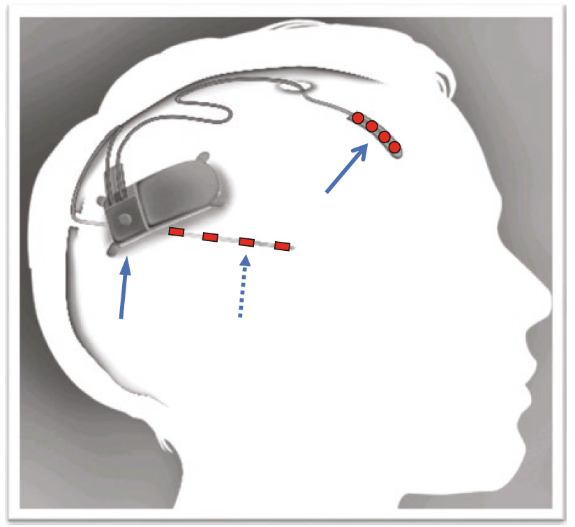

## Learn about Epilepsy

Table of contents:
- [Introduction](#introduction)
- [What is a seizure?](#what_is_a_seizure)
- [What is not a seizure?](what_is_not_a_seizure)
- [What type of seizures are?](#what_types_of_seizures_are)
- [What causes seizures?](#what_causes_seizures)
- [What is a provoked seizure?](#what_is_a_provoked_seizure)
- [What is epilepsy?](#what_is_epilepsy)
- [How can epilepsy be diagnosed?](#diagnose_epilepsy)
- [What are the mechanisms of epilepsy?](#mechanism_epilepsy)
- [What are the risk factors for Epilepsy?](#risk_factors_epilepsy)
- [How can epilepsy be treated?](#treatment_epilepsy)
- [How many people suffer Epilepsy?](#epidemiology_epilepsy)
- [Where can I learn more?](#learn_more)
- [Bibliography](#bib)

### Introduction
In the next paragraphs, we write some answers to the most usually ask questions about seizures & epilepsy. All the information collected here is obtained from scientific sources, and we try to provide reliable and clear information about these topics. However, this guide leaves a lot of details out and should be considered only as an overview of the matter. If you have doubts about your health or think that you may suffer from seizures or epilepsy, you should visit a doctor. Only a physician can establish a reliable diagnostic of your symptoms. Early detection of this condition could help to improve the quality of life and minimize the risk of further complications.

### What is a seizure?
An epileptic seizure is a transient occurrence of signs and symptoms due to abnormal excessive or synchronous neuronal activity in the brain [[3](#bib)]. The period during which the seizure occurs is called the ictus period. The aura is the earliest part of the seizure recognized (and often the only part remembered by the patient), and it could act as a warning. The period immediately after a seizure is the postictical period [[10](#bib)].

### What is not a seizure? [[1](#bib)]
Not every episode of shaking or loss of awareness is necessarily a seizure. Several different conditions can produce episodes of shaking or loss of consciousness,  for example, syncopes, migraines, transient ischemic attacks, and sleep disorders. To evaluate an episode it should be taken into account:
- **Precipitating factors**: what were the circumstances before the event?
- **Prodrome**: what did the patient experience prior to the event?
- **Time course**: how long last the seizure?
- **Stereotypy**: do the events happen the same way every time?
- **Behavior** during factors
- **Nature or recovery**: the recovery was made with prolonged confusion or was it rapid?

In order to arrive at the proper diagnosis, it is important to also considerer other non-epileptic etiologies.

### What types of seizures are? [[5](#bib)]
Seizures are usually named by how they begin and develop:
- **Generalized onset**: originating from and rapidly engaging networks of both brain hemispheres of the brain
- **Focal onset**: originating within the networks of one hemisphere of the brain. Focal onsets can be further classified by the level of awareness (aware vs. impaired awareness) and motor vs. non-motor
- A seizure may be **“unclassified”** if there is not enough information or inability to place it in other categories.

### What causes seizures?
It is very important to identify the origin of a seizure for treatment and prognostication. Some of the epilepsies may fit into more than one category [[2](#bib)].
Seizures can be caused by:
- **Genetic causes**: around 15% of people with epilepsy have a first-degree relative with epilepsy. The risk of suffering epilepsy is three times higher if a first-degree relative has epilepsy. Genetic epilepsies account for 15-20% of all epilepsies [[6](#bib)].
- **Metabolic causes**: epilepsy is common in disorders from inborn errors of metabolism (for example vitamin B responsive disorders or disorders of amino acid). Many metabolic epilepsies are also considered epileptic encephalopathies, in which the seizures may contribute to severe cognitive and behavioral impairments [[2](#bib)].
- **Structural**: some structural problems are associated with seizures, for example, malformations of cortical development, hippocampal sclerosis, tuberous sclerosis complex, brain tumors, vascular events (hypoxic-ischemic injury, subarachnoid hemorrhage, stroke) and traumatic brain injury [[2](#bib)].
- **Central nervous system infections**: some infections are related to the development of epilepsy (meningitis, encephalitis, neurocysticercosis and cerebral abscess) [[2](#bib)].
- **Autoimmune causes**: some autoimmune diseases as multiple sclerosis and Ramussen encephalitis can provoque seizures [[2](#bib)].

### What is a provoked seizure?
Provoked seizures occur as the result of the seizure threshold being transiently lowered by some disturbance. They do not count toward a diagnosis of epilepsy. Some causes of provoked seizures could be medications, recreational drugs, alcohol withdrawal, barbiturate or benzodiazepine withdrawal and metabolic [[1](#bib)].

### What is epilepsy?
Epilepsy is a complex symptom caused by a variety of pathologic processes in the brain [[10](#bib)]. Epilepsy is characterized by an enduring predisposition to generate epileptic seizures, and by the neurobiological, cognitive, psychological, and social consequences of this condition. The definition of epilepsy requires the occurrence of at least one epileptic seizure [[3](#bib)]. This means, that epilepsy is a disease of the brain defined by any of the following conditions [[4](#bib)]:
- At least two unprovoked (or reflex) seizures occurring in less than 24 hours
- One unprovoked (or reflex) seizure and a probability of further seizures similar to the general recurrence risk (at least 60%) after two unprovoked seizures, occurring over the next 10 years
- Diagnosis of an epilepsy syndrome

### How can epilepsy be diagnosed? [[2](#bib)]
Any of the following criteria can be used to diagnose epilepsy.
- At least two unprovoked (or reflex) seizures occurring in less than 24 hours
- One unprovoked (or reflex) seizure and a probability of further seizures similar to the general recurrence risk (at least 60%) after two unprovoked seizures, occurring over the next 10 years
- Diagnosis of an epilepsy syndrome: although epilepsy is largely a clinical diagnosis, EEG may help to establish a reliable diagnosis.

### What are the basic mechanisms of epilepsy? [[10](#bib)]
The seizures occur due to abnormal neuronal discharges. Although the causes of epilepsy are many, the fundamental disorder is derived from abnormal synchronous discharges of network neurons. The events that lead from the seizure are not completely understood, some hypothesis point to a decrease in the synaptic inhibition of the neurons,  increases in synaptic excitation, alteration in potassium and calcium currents or changes in the extracellular ion concentrations.

### What are the risk factors for Epilepsy? [[2](#bib)]
Some of the factors that could increase the probability of developing epilepsy are:
- Complex febrile seizures of long duration (more than 15 min) or more than one seizure in 24 hours
- Family history of epilepsy
- Head trauma with loss of consciousness
- Meningitis or encephalitis
- Perinatal distress

### How can epilepsy be treated? [[7](#bib)]
There is a wide range of treatments to prevent seizures. Here we describe the most usual ones.

##### Antiepileptic drugs:
Seizures are treated with antiepileptic drugs (AED). For this is important to identify the type of epilepsy (generalized vs. focal). The is narrow spectrum AEDs are indicated for focal epilepsies but may exacerbate genetic generalized epilepsies. Some of the medications used in generalized epilepsy are benzodiazepines, felbamate, lamotrigine, levetiracetam, perampanel, rufinamide, topiramate, valproic acid, and zonisamide. On the other hand, the drugs used for focal epilepsies are carbamazepine, eslicarbazepine, ezogabine, gabapentin, lacosamide, oxcarbazepine, phenobarbital, phenytoin, pregabalin, tiagabine.
Some antiepileptic drugs may cause serious life-threatening reactions, especially worsening depression and suicidal ideation.

##### Vagus nerve stimulation:

*Vagus nerve stimulation. Taken from [[7](#bib)]*

Additionally, other types of treatment can be used to fight seizures. For example, the vagus nerve stimulation. This stimulation consists of placing subcutaneously a small pulse generator in the left chest with a lead attached to the left vagus nerve. This nerve is stimulated at regular intervals.

##### Responsive neurostimulation:

*Rsponsive neuroestimulation. Taken from [[7](#bib)]*

Consist of a closed-loop system that continuously records the electrocorticographic activity and provides responsive electrical stimulation when certain patterns are detected. The neurostimulator should be implanted cranially and connected to one or two depth or subdural cortical strip leads.

##### Deep brain stimulation

*Deep brain stimulation. Taken from [[7](#bib)]*

Bilateral electrodes are implanted in the anterior nucleus of the thalamus. It has proved to be effective, but its mechanism is unknown. It can help with reducing the seizure severity, improvement in the quality of life and neurological measures.

##### Diet Therapy
Special types of diet can help to reduce the frequency of the seizures. The Ketogenic Diet, which consists of a ratio of 3:1 between fat and carbohydrates and protein,  has proved to reduce the seizures, especially with children and adolescents. The Modified Atkins Diet presented effectivity similar to Ketogenic. However, both diets have adverse effects and can be easily discontinued by the patients [[7](#bib)].

##### Epilepsy Surgery
Approximately 30% of the patients with epilepsy will keep having seizures despite the used of medications [[8](#bib)]. This is called drug-resistant epilepsy (DRE). A patient is considered to have DRE when two antiepileptic drugs have failed in improving his / her condition. Surgery is an option for patients with this kind of epilepsy.
A pre-surgical evaluation is needed to select between the different kinds of surgical interventions. This evaluation consists of a series of exams and monitoring with to goal of determining the exact region of the intervention. According to the region of the brain intervened, the surgery can produce important secondary effects that affect the life quality of the patient [[7](#bib)].

### How many people suffer Epilepsy?
Epilepsy has a prevalence of 0.5 - 2% amongst the general population. In two-thirds of cases, the onset of the disease occurs during childhood or adolescence [[8](#bib)]. 80% of persons with epilepsy are in the developing world [[9](#bib)].

### Where can I learn more?
There is a lot of information on the internet about Epilepsy. However, it is important to be careful about how we read this information. Here we present some recognized sources of information about seizures and epilepsy, with which you can learn more about his topic.

- [World Health Organization about Epilepsy](https://www.who.int/mental_health/neurology/epilepsy/en/)
- [Epilepsy.org (United States)](https://www.epilepsy.com/learn/about-epilepsy-basics/what-epilepsy)
- [National Institute of Neurological Disorders and Stroke (United States)](https://www.ninds.nih.gov/disorders/all-disorders/epilepsy-information-page)
- [International League against Epilepsy (United States)](https://www.ilae.org/education)
- [National Health Service (United Kingdom)](https://www.nhs.uk/conditions/epilepsy/)

### Bibliography
- [1] [Sazgar M., Young M.G. (2019) What Is Not a Seizure?. In: Absolute Epilepsy and EEG Rotation Review. Springer, Cham](https://link.springer.com/chapter/10.1007%2F978-3-030-03511-2_1)
- [2] [Sazgar M., Young M.G. (2019) Seizures and Epilepsy. In: Absolute Epilepsy and EEG Rotation Review. Springer, Cham](https://link.springer.com/chapter/10.1007%2F978-3-030-03511-2_2)
- [3] [Fisher RS, van Emde Boas W, Blume W, et al. Epileptic seizures and epilepsy: definitions proposed by the International League Against Epilepsy (ILAE) and the International Bureau for Epilepsy (IBE). Epilepsia. 2005;46(4):470–2.](https://www.ncbi.nlm.nih.gov/pubmed/15816939)
- [4] [Fisher RS, Acevedo C, Arzimanoglou A, et al. ILAE official report: a practical clinical definition of epilepsy. Epilepsia. 2014;55(4):475–82.](https://www.ncbi.nlm.nih.gov/pubmed/24730690)
- [5] [Fisher RS, Cross JH, D’Souza C, et al. Instruction manual for the ILAE 2017 operational classification of seizure types. Epilepsia. 2017;58(4):531–42](https://www.ncbi.nlm.nih.gov/pubmed/28276064)
- [6] [Jallon P, Latour P. Epidemiology of idiopathic generalized epilepsies. Epilepsia. 2005;46(Suppl 9):10–4.](https://www.ncbi.nlm.nih.gov/pubmed/16302871)
- [7] [Sazgar M., Young M.G. (2019) Treatment of Seizures. In: Absolute Epilepsy and EEG Rotation Review. Springer, Cham](https://link.springer.com/chapter/10.1007%2F978-3-030-03511-2_3)
- [8] [Aronica, E., Mühlebner, A. (2017). Neuropathology of epilepsy. In Handbook of Clinical Neurology.](https://www.sciencedirect.com/handbook/handbook-of-clinical-neurology)
- [9] [Birbeck, G. (2010). Epilepsy care in developing countries: part I of II. Current Review in Clinical Science, 10(4).](https://journals.sagepub.com/doi/10.1111/j.1535-7511.2010.01362.x)
- [10] [Browne, Th. & Holmes, G. (2008). Handbook of Epilepsy (4th edition). Wolters Kluwer](https://www.bookdepository.com/Handbook-Epilepsy-Thomas-R-Browne/9780781773973)
